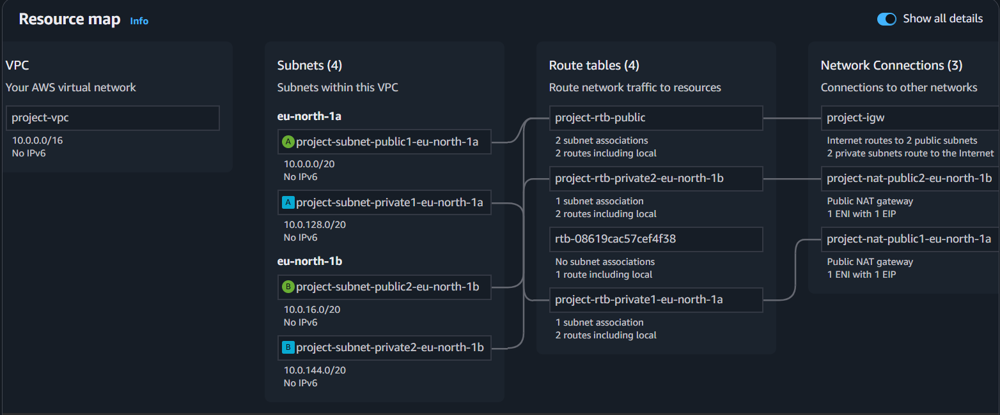
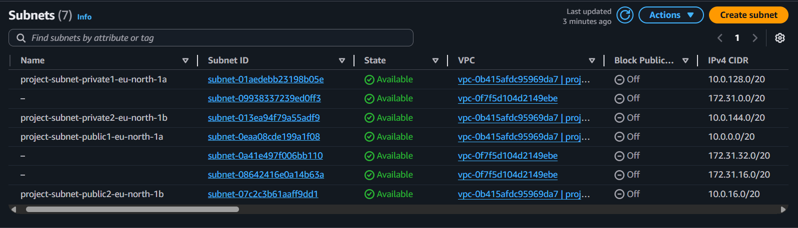
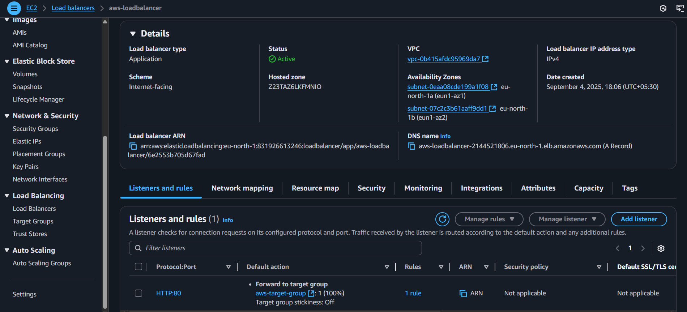
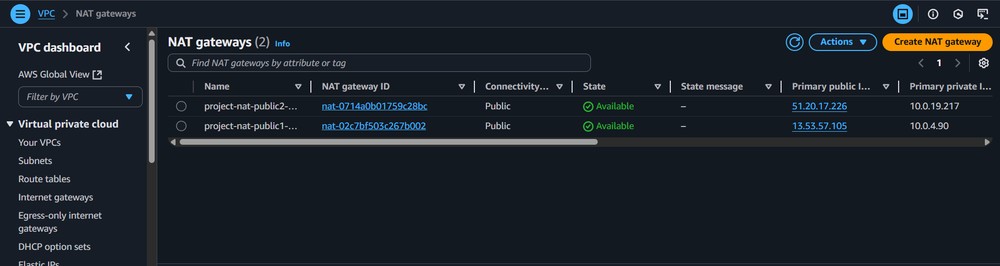
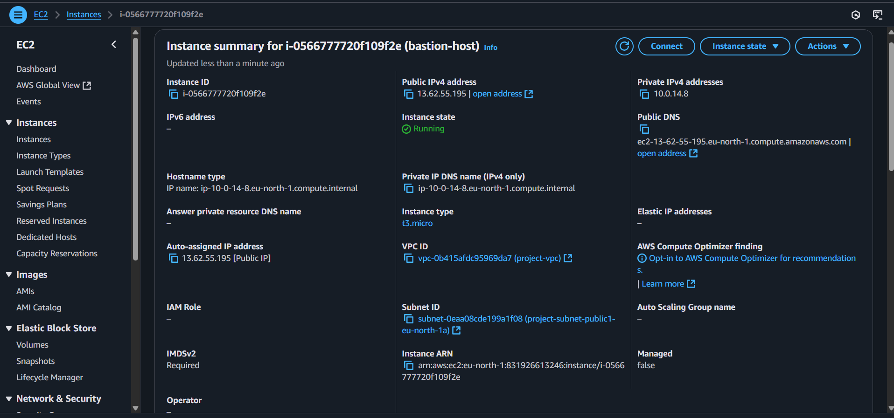
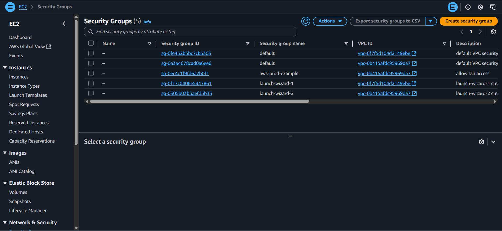

# AWS Production-Ready Cloud Architecture 
Production-ready AWS VPC architecture with Auto Scaling, Load Balancer, NAT, and Bastion Host

## Project Overview
This project implements a production-grade web application architecture on AWS, focusing on high availability, scalability, and security.  
The setup simulates how real-world applications are deployed in enterprises using VPC networking, Auto Scaling, Load Balancing, and secure access controls.

---

## Architecture Design
- VPC: Custom Virtual Private Cloud with isolated networking.
- Subnets: Public and private subnets distributed across two Availability Zones (AZs).
- Auto Scaling Group (ASG): Launches and manages EC2 instances using a Launch Template.
- Application Load Balancer (ALB): Routes incoming traffic across EC2 instances for fault tolerance.
- NAT Gateway: Provides secure outbound internet access for private instances.
- Bastion Host: Securely connects administrators to private EC2 instances via SSH.

---

## Security Controls
- Private EC2 Instances: Not exposed to the internet; accessible only through the Bastion Host.  
- Bastion Host: Restricted SSH access from a specific IP range.  
- Security Groups:  
  - ALB → EC2 (HTTP/HTTPS).  
  - Bastion Host → EC2 (SSH).  
  - EC2 → NAT Gateway (outbound internet only).  

---

## Data & Access Flow
- User Traffic:  
  End Users → ALB (Public Subnet) → EC2 Instances (Private Subnet).  
- Admin Access:  
  Admin → Bastion Host (Public Subnet) → Private EC2 (via SSH).  
- Outbound Connectivity:  
  EC2 (Private Subnet) → NAT Gateway → Internet.  

---

## AWS Services Used
- Amazon VPC  
- Amazon EC2 (with Launch Template & Auto Scaling Group)  
- Elastic Load Balancing (ALB)  
- NAT Gateway  
- Bastion Host  
- Security Groups 
---

## Deployment Steps
1. Create VPC with CIDR block and enable DNS support.  
2. Configure Subnets (public + private) across two Availability Zones.  
3. Deploy Internet Gateway & NAT Gateways for outbound connectivity.  
4. Launch Bastion Host in a public subnet for secure SSH access.  
5. Create Launch Template defining AMI, instance type, and security groups.  
6. Set up Auto Scaling Group to maintain EC2 instances in private subnets.  
7. Deploy Application Load Balancer across public subnets and attach target groups.  
8. Configure Security Groups to strictly control access.  

---

## Screenshots

- **VPC Setup**  
  

- **Subnets**  
  

- **Auto Scaling Group**  
  

- **Launch Template**  
  

- **Application Load Balancer**  
  

- **NAT Gateway**  
  

- **Bastion Host**  
  

- **Security Groups**  
  

-**Hosted Website**

---

## Learning Outcomes
- Designed a multi-AZ highly available architecture.  
- Implemented secure access using Bastion Host and private subnets.  
- Automated scaling using Launch Templates and ASGs.  
- Understood traffic flow, routing, and isolation in AWS VPC.  

